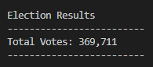
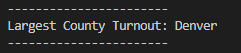
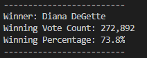

# Election Audit (Precinct / County)

## Election-Audit Overview

The Colorado Broad of Elections has requested to analyse the election data and provide a breakdown of the voting turnouts for each county in the precinct.

## Resources

- Data Source: election_results.csv
- Software: Python 3.8.3, Visual Studio Code: 1.48.2

## Election-Audit Results

1. Total number of votes cast in this congessional election was 369,711 votes.

2. County Votes Turnout:

    - Jefferson county turnout was 10.5% of the votes with 38,855 number of votes.

    - Denver county turnout was 82.8% of the votes with whooping 306,055 number of votes.

    - Arapahoe county turnout was 6.7% of the votes with 24,801 number of votes.

3. *Largest county with the number of votes is Denver.*

4. Candidate and their votes result were:

    - Charles Casper Stockham received 23.0% of the vote and 85,213 number of votes.

    - Diana DeGette received 73.8% of the vote and 272,892 number of votes.

    - Raymon Anthony Doane received 3.1% of the vote and 11,606 number of votes.

5. Candiate that won the congrssional elections in the precinct is 

***Diana DeGette** who received **73.8%** of the votes and with a large **272,892** number of votes.*

## Election Audit Summary

A slight proposal to the colorado board of elections, with modifications to the code, I believe this script can be useful in not only small election tallies but for larger counties, precincts, state etc.

  - Example 1:

 Having a list of counties, within a list of precincts, within a list of states. (or having a dictionary with states, precincts and counties)

  - Example 2:

Incorporating functions to contain a part of the code that needs to be called. like when calculating percentage of votes, (Incase in a larger anc complecated data.)
